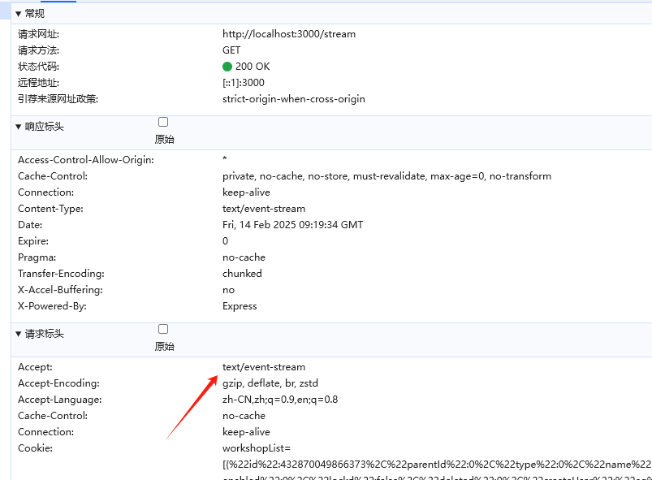

# AI 调用之可读流的应用

> [!TIP]
> 最近碰到了业务开发需要调用 AI 对话的服务，这里是采用了 DeepSeek 的调用，由于需要快速上线，并且官网有现成的 Nodejs 接口文档，就交给我来对接实现了

## 前置

### SSE

SSE 是一种基于 HTTP 的单向通信技术，和 Websocket 一样的是它是持久化连接，不同的是在客户端握手成功后由服务端一直进行发送数据包，客户端被动接收。
当然也可以基于这种设计实现为类似双向通信的过程。

### 可读流

Javascript 流式接口中提供了`ReadableStream`对象表示可读数据流，并且`FetchAPI`的响应体中 body 属性也是一个`ReadableStream`对象

`ReadableStreamDefaultController`是`ReadableStream` 对象构造初始化时传递的的接口，可以允许我们定义内部的状态和队列

### EventSource

EventSource 接口用来处理`text/event-stream`类型的请求，一般 SSE 接口也就是这个类型的


### TextDecoder/TextEncoder

可以对字符进行编码解码的 API,特别是字节流的处理非常方便

> [!TIP]
> 在没开启 HTTP2 情况下，默认最大连接数是被浏览器限制的(6)，而 HTTP2 中则是由服务器和客户端协商，默认 100

## 代码

### SSE 接口实现

我们用`Nest`模拟一个 SSE 接口调用

```typescript
import { Controller, Get, Sse } from "@nestjs/common";
import { AppService } from "./app.service";
import { Observable } from "rxjs";

@Controller()
export class AppController {
  constructor(private readonly appService: AppService) {}
  @Sse("stream")
  stream() {
    return new Observable((observer) => {
      observer.next({ data: { msg: "aaa" } });

      setTimeout(() => {
        observer.next({ data: { msg: "bbb" } });
      }, 2000);

      setTimeout(() => {
        observer.next({ data: { msg: "ccc" } });
      }, 5000);
    });
  }
}
```

### EventSource 调用

而通过`EventSource` 则可以非常简单处理 SSE 接口

```js
var evtSource = new EventSource("http://localhost:3000/stream");
var eventList = document.querySelector("ul");
evtSource.onmessage = function (e) {
  var newElement = document.createElement("li");

  newElement.textContent = "message: " + e.data;
  eventList.appendChild(newElement);
};
```

### 通过 Fetch 调用

通过 body 属性也可以对 SSE 接口进行读取

```js
const main = async () => {
  const res = await fetch("http://localhost:3000/stream");

  // body 是 ReadableStream类型 拿到可读流
  const reader = res.body.getReader();
  console.log(reader);

  const writeInfo = async () => {
    const { done, value } = await reader.read(); // 类似迭代器，每次read都会取出一次数据
    console.log(done, value);

    if (done) {
      console.log("read complete");
      return;
    }

    // 通过流读出来的数据 通常是 ArrayBuffer，需要进行转换
    var decode = new TextDecoder("utf-8");
    var newElement = document.createElement("li");
    // 解析流数据转为文本
    newElement.textContent = "message: " + decode.decode(value);
    eventList.appendChild(newElement);

    writeInfo();
  };

  writeInfo();
};
```

### 迭代器

我们还可以通过迭代器来获取流数据，但是有比较大的兼容性问题，这里贴一个实例代码

```js
const response = await fetch("https://www.example.org");
let total = 0;

// Iterate response.body (a ReadableStream) asynchronously
for await (const chunk of response.body) {
  // Do something with each chunk
  // Here we just accumulate the size of the response.
  total += chunk.length;
}

// Do something with the total
console.log(total);
```

## Mock

我们也可以手动构建模拟一个可读流，并控制内容的输出

```js
const MockSSERequest = (data = [], delay = 300) => {
  let controllerInstance = null; // 可读流关联
  const encoder = new TextEncoder();

  // 推送数据
  const pushData = () => {
    if (data.length === 0) {
      controllerInstance.close(); // 关闭流
      return;
    }

    const chunk = data.slice(0, 1);
    data = data.slice(1);

    // 将utf8内容转为unit8Array传递
    controllerInstance.enqueue(encoder.encode(chunk));
    if (data.length > 0) {
      setTimeout(pushData, delay);
    } else {
      // 没内容了关闭流
      controllerInstance.close();
    }
  };

  // 返回一个可读流的  Response对象
  const getResponse = () => {
    return new Promise((resolve, reject) => {
      setTimeout(() => {
        resolve(new Response(stream));
      }, delay);
    });
  };
  // 构建对象，并提供了start属性作为初始化调用
  // controller参数就是ReadableStreamDefaultController接口， 它提供了 enqueue来控制队列，和close来关闭流
  const stream = new ReadableStream({
    start(controller) {
      controllerInstance = controller;
      pushData();
    },
    cancel(reason) {
      console.log("Stream canceled", reason);
    },
  });

  return getResponse;
};
```

然后调用这个模拟数据

```js
const mainMock = async () => {
  // 执行后 内部ReadableStream就会开始工作，直到controller的关闭
  const sse = MockSSERequest("这是一段模拟的数据流噢!", 300);

  const res = await sse();
  const reader = res.body.getReader();

  const writeInfo = async () => {
    const { done, value } = await reader.read();
    console.log(done, value);

    if (done) {
      console.log("read complete");
      return;
    }

    // 通过流读出来的数据 通常是 ArrayBuffer，需要进行转换
    var decode = new TextDecoder("utf-8");
    var newElement = document.createElement("li");
    // 解析流数据转为文本
    newElement.textContent = "message: " + decode.decode(value);
    eventList.appendChild(newElement);

    writeInfo();
  };

  writeInfo();
};
```

## 后记

后续在本地部署`AnythingLLM` 做接口调用的时候，如果不是封装好的 SSE 接口，而是通过 Fetch 获取数据，需要注意是需要我们自己手动解析块数据的

> 如果是通过 fetch 获取，很有可能获取的数据因为 SSE 数据是分块发送的，每块可能包含多个消息，也可能只包含部分消息。如果你没有正确解析这些分隔符，就会导致数据不完整或混乱。

1. 如果是处理 text/event-stream 数据，优先使用 EventSource，它能自动解析 SSE 数据。

- SSE 是一种特殊的流式传输协议，它的数据格式和普通的 HTTP 响应不同。SSE 数据通常以 data: 开头每，条消息以两个换行符 \n\n 结束。如果你直接用普通的 fetch 或 ReadableStream 来处理，可能会导致数据解析错误。

2. 如果需要手动处理流式响应，确保正确解析 data: 和 \n\n 分隔符。
3. fetch 可以用于获取流式响应，但需要手动处理数据格式。
4. for await (const chunk of res.body) 的问题：

- 这种方式更适合处理普通的流式响应（如 application/octet-stream 或 text/plain）。对于 SSE，你需要解析 data: 和 \n\n 来提取有效数据。

```javascript
const handleLocalData = async (inputValue) => {
  const lastItem = chatList.value[0];

  try {
    const [response, error] = await ChatAPI(inputValue, Signal);

    if (error) {
      console.log(error);
      if (!lastItem.content) {
        lastItem.role = "error";
        lastItem.content = "服务器繁忙,请稍后再试";
      }
      isStreamLoad.value = false;
      loading.value = false;
      return;
    }

    const reader = response.body.getReader();
    let buffer = "";

    while (true) {
      const { done, value } = await reader.read();
      if (done) break;

      const decoder = new TextDecoder("utf-8");
      const chunk = decoder.decode(value);
      buffer += chunk;

      // 手动解析 SSE 数据
      const messages = buffer.split("\n\n"); // 按消息分隔符分割
      buffer = messages.pop(); // 保留未完成的消息部分

      messages.forEach((message) => {
        if (message.startsWith("data: ")) {
          const data = JSON.parse(message.slice(6)); // 去掉 'data: '
          console.log(data);

          // 更新 UI 或逻辑
          lastItem.content += data.textResponse; // 假设返回的数据是 JSON 格式
        }
      });
    }
  } catch (error) {
    console.error("Error stream:", error);
  }
};
```
