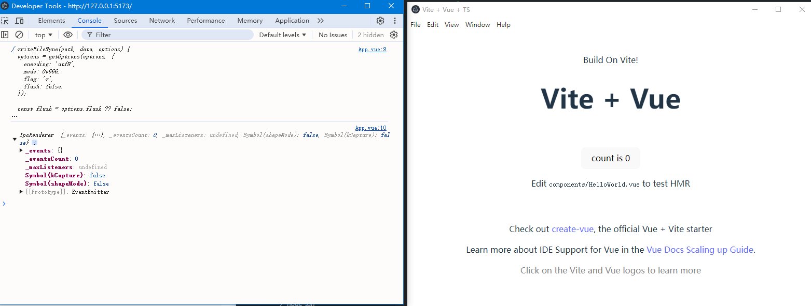

# Electron与Vue3

## Electron概述
1. 定制Chromium，集成到框架中。通过集成Chromium，开发者可以用Web开发的形式绘制界面，并使用Cookie/indexDb的方式存取数据
2. 定制Nodejs，集成到框架中。提供文件IO、Socket、子进程等原生Nodejs能力
3. 通过消息轮询打通Nodejs和Chromium的消息循环。通过轮询Nodejs消息将其同步到Chromium，使得Web中得到Nodejs的能力
4. 通常Electron内置模块提供桌面开发API，访问操作系统、托盘、剪切板、通知...


> [!NOTE]
> 每个Electron都是由1个主进程 + N个渲染进程组成

每个Electron启动时，会先加载主进程的逻辑，主进程会创建N个窗口，可以狭义的认为一个窗口就是一个渲染进程，主进程管理所有的渲染进程

渲染进程与主进程通过 IPC 消息管道进行通信。大部分时候还是通过主进程来中转消息以达到渲染进程间通信的目的。

Electron 提供的一系列内置模块大部分是专门为主进程的逻辑服务的，比如 app 模块、BrowserWindow 模块和 session 模块等；

少量模块是专门为渲染进程的逻辑服务的，比如 ipcRenderer 模块、webFrame 模块等；只

有少量模块是两个进程可以同时使用的，比如：clipboard 模块、desktopCapturer 模块等。


## 构建Vite环境
### 创建项目
通过`create`命令创建一个Vite项目，随后将vue从生产依赖改为开发依赖，Vue库将来会被编译到输出目录中，且安装包还会依赖`package.json`,尽量优化它的内容

> [!TIP]
> 将package.json文件中的 type:module 移除，不要让项目默认以固定模块方式允许，后续通过文件名进行区分，后续编译时Electron和Vite都会对文件做编译优化

> [!TIP]
> Electron 存在postinstall钩子，所以项目全程使用非Pnpm的包管理器执行

### npmrc
Electron不会依赖于包管理的设置，我们需要手动在项目中指定远程加载地址
```txt
registry=https://registry.npmmirror.com
electron_mirror=https://npmmirror.com/mirrors/electron/
electron_builder_binaries_mirror=https://npmmirror.com/mirrors/electron-builder-binaries/
```

### 开发插件
```ts
import {ViteDevServer} from 'vite'
export let devPlugin = () => {
    return {
        name:"dev-plugin", // 插件id
        configureServer(server:ViteDevServer){   // 配置钩子，会在开发阶段合并传入的选项
            require("esbuild").buildSync({  // 通过require 动态导入并使用同步编译的方法 将主入口编译出去
                entryPoints:['./src/main/mainEntry.ts'],
                bundle:true,
                platform:'node',
                outfile:'./dist/mainEntry.js',
                external:['electron']
            })

            server.httpServer?.once('listening',()=>{
                let {spawn} = require('child_process')  // 使用子进程

                let addressInfo = server.httpServer?.address() as unknown as {address:string;port:string}
                let httpAddress = `http://${addressInfo.address}:${addressInfo.port}`

                //require('electron').toString() 返回可执行路径 第一个参数作为执行入库传递 第二个参数是 Vue 页面的 http 地址
                // 这里的第二个参数是因为 主入口文件内部通过 process.argv[2] 读取了这第二个参数作为加载的页面， 实际上是代码读取，而不是cli传给electron处理的
                let electronProcess = spawn(require('electron').toString(),["./dist/mainEntry.js", httpAddress],{
                    cwd:process.cwd(), //设置当前的工作目录
                    stdio:"inherit" //让 electron 子进程的控制台输出数据同步到主进程的控制台
                })

                // 如果主进程销毁，则Http端也关闭
                electronProcess.on('close',()=>{
                    server.close();
                    process.exit()
                })
            })
        }
    }
}
```

这里需要琢磨的是，至始至终都是依赖于Vite的构建和热更新能力，而我们插件做的就是把主入口编译好，然后执行的时候拿到Vite构建好的Http服务器输出地址作为URL窗口加载

### 渲染进程集成内置模块和Node环境
> src/main/mainEntry.ts
```ts
import { app, BrowserWindow } from "electron";

//设置渲染进程开发者调试工具的警告
process.env.ELECTRON_DISABLE_SECURITY_WARNINGS = "true";

let mainWindow:BrowserWindow

app.whenReady().then(()=>{
    mainWindow = new BrowserWindow({
        webPreferences:{
            nodeIntegration:true, // 允许web页面使用node api
            webSecurity:false, // 禁用web安全特性 通常用于开发阶段，以便加载本地文件和执行不受信任的代码
            allowRunningInsecureContent:true, //允许渲染进程加载和运行不安全的内容，比如使用 file:// 协议加载的本地资源
            contextIsolation:false, //关闭上下文隔离，这意味着 Electron API 可以直接在渲染进程的同一个 JavaScript 上下文中使用，而不是在一个隔离的上下文中。
            webviewTag:true, //允许在渲染进程中使用 <webview> 标签，这可以用来在应用中嵌入其他网页。
            spellcheck:false,//禁用拼写检查功能。
            disableHtmlFullscreenWindowResize:true //禁用在 HTML 全屏模式下窗口的自动调整大小
        }
    });
    mainWindow.webContents.openDevTools({mode:'undocked'})
    mainWindow.loadURL(process.argv[2])
})
```

### Vite模块别名和解析
Vite会禁止浏览器环境下Node内置模块的使用，这里使用一个插件来做依赖预构建处理
> npm i vite-plugin-optimizer -D

1. optimizer的作用就是在预构建阶段把我们的模块规则创建一个对应的临时目录，比如使用vue别名, node_modules/vue.js。然后这个文件就是我们要写入并导出的内容
2. optimizer({ vue: `const vue = window.Vue; export { vue as default }`,}) 输出到 node_modules/.vite-plugin-optimizer/vue.js
3. 然后插件会在Vite配置选项中，写入对应的别名resolve.alias别名，指向我们创建的这个临时文件
4. 最后将vue这个模块写入到 optimizeDeps.exclude，不参与依赖预构建
5. 而到了渲染进程执行到：import fs from "fs" 时，就会请求这个目录下的 fs.js 文件，这样就达到了在渲染进程中引入 Node 内置模块的目的。
6. getReplacer 方法是我们为 vite-plugin-optimizer 插件提供的内置模块列表

```ts
// vite.config.ts
import { defineConfig } from 'vite'
import vue from '@vitejs/plugin-vue'
import {devPlugin,getReplacer} from './plugins/devPlugin'
const optimizer = require('vite-plugin-optimizer')

// https://vite.dev/config/
export default defineConfig({
  plugins: [vue(),devPlugin(),optimizer(getReplacer())],
})

```

```ts
//plugins/devPlugin.ts
export let getReplacer = () => {
    // 内置模块列表，根据使用需求手动添加
    let externalModels = ["os", "fs", "path", "events", "child_process", "crypto", "http", "buffer", "url", "better-sqlite3", "knex"];
    let result:Record<string,any> = {};
    for (let item of externalModels) {
      result[item] = () => ({
        find: new RegExp(`^${item}$`),
        code: `const ${item} = require('${item}');export { ${item} as default }`,
      });
    }

    // electron模块配置
    result["electron"] = () => {
      let electronModules = ["clipboard", "ipcRenderer", "nativeImage", "shell", "webFrame"].join(",");
      return {
        find: new RegExp(`^electron$`),
        code: `const {${electronModules}} = require('electron');export {${electronModules}}`,
      };
    };
    return result;
  };
```

```typescript
import fs from "fs";
import { ipcRenderer } from "electron";
import { onMounted } from "vue";

onMounted(() => {
  console.log(fs.writeFileSync);
  console.log(ipcRenderer);
});
```




## 构建打包配置
> npm i electron-builder -D 安装打包库

::: details 点我查看打包过程简述

首先 electron-builder 会收集应用程序的配置信息。比如应用图标、应用名称、应用 id、附加资源等信息。有些配置信息可能开发者并没有提供，这时 electron-builder 会使用默认的值，总之，这一步工作完成后，会生成一个全量的配置信息对象用于接下来的打包工作。

接着 electron-builder 会检查我们在输出目录下准备的 package.json 文件，查看其内部是否存在 dependencies 依赖，如果存在，electron-builder 会帮我们在输出目录下安装这些依赖。

然后 electron-builder 会根据用户配置信息：asar 的值为 true 或 false，来判断是否需要把输出目录下的文件合并成一个 asar 文件。

然后 electron-builder 会把 Electron 可执行程序及其依赖的动态链接库及二进制资源拷贝到安装包生成目录下的 win-ia32-unpacked 子目录内。

然后 electron-builder 还会检查用户是否在配置信息中指定了 extraResources 配置项，如果有，则把相应的文件按照配置的规则，拷贝到对应的目录中。

然后 electron-builder 会根据配置信息使用一个二进制资源修改器修改 electron.exe 的文件名和属性信息（版本号、版权信息、应用程序的图标等）。

如果开发者在配置信息中指定了签名信息，那么接下来 electron-builder 会使用一个应用程序签名工具来为可执行文件签名。

接着 electron-builder 会使用 7z 压缩工具，把子目录 win-ia32-unpacked 下的内容压缩成一个名为 yourProductName-1.3.6-ia32.nsis.7z 的压缩包。

接下来 electron-builder 会使用 NSIS 工具生成卸载程序的可执行文件，这个卸载程序记录了 win-ia32-unpacked 目录下所有文件的相对路径，当用户卸载我们的应用时，卸载程序会根据这些相对路径删除我们的文件，同时它也会记录一些安装时使用的注册表信息，在卸载时清除这些注册表信息。

最后 electron-builder 会使用 NSIS 工具生成安装程序的可执行文件，然后把压缩包和卸载程序当作资源写入这个安装程序的可执行文件中。当用户执行安装程序时，这个可执行文件会读取自身的资源，并把这些资源释放到用户指定的安装目录下

:::

### 开发打包插件
通过插件，将开发和打包两者分离，根据需要做不同的事情
```ts
import { buildPlugin } from "./plugins/buildPlugin"

// https://vite.dev/config/
export default defineConfig({
  build:{
    rollupOptions:{
      // 打包插件时以Rollup格式编写的 并在build阶段声明
      plugins:[buildPlugin()] 
    }
  }
})
```

```ts
// plugins/buildPlugin.ts
import path from 'path'
import fs from 'fs'

export let buildPlugin = () => {
    return {
      name: "build-plugin",
      closeBundle: () => {
        let buildObj = new BuildObj();
        buildObj.buildMain();  // 主入口打包输出
        buildObj.preparePackageJson();
        buildObj.buildInstaller();
      },
    };
};

// 处理打包主函数
class BuildObj{
    // 编译主进程代码
    buildMain(){
        require('esbuild').buildSync({
            entryPoints:['./src/main/mainEntry.ts'],
            bundle:true,
            platform:'node',
            minify: true, // 生产环境 编译混淆
            outfile:'./dist/mainEntry.js',
            external:['electron']
        })
    }
    // 为生产环境准备package.json
    preparePackageJson(){
        // 读取包文件和内容
        let pkgJsonPath = path.join(process.cwd(),'package.json')
        let localPkgJson = JSON.parse(fs.readFileSync(pkgJsonPath,"utf-8"))
        // 读取版本并锁死
        let electronConfig = localPkgJson.devDependencies.electron.replace("^", "");
        // 改变主入口
        localPkgJson.main = "mainEntry.js";
        // 移除无用信息
        delete localPkgJson.scripts
        delete localPkgJson.devDependencies
        // 开发依赖指定自己
        localPkgJson.devDependencies = { electron: electronConfig };

        // 将重写后包文件出到输出目录，并创建 输出目录的 依赖目录node_modules
        let tarJsonPath = path.join(process.cwd(), "dist", "package.json");
        fs.writeFileSync(tarJsonPath,JSON.stringify(localPkgJson))
        // 手动创建这个目录 阻止electron-builder为我们创建一些没用的目录或文件
        fs.mkdirSync(path.join(process.cwd(),"dist/node_modules"))
    }
    // 使用electron-builder制作安装包
    buildInstaller(){
        let options = {
            config:{
                directories:{
                    output:path.join(process.cwd(),"release"), // 被builder打包后产物目录
                    app:path.join(process.cwd(),"dist") //应用的源代码目录 对应dist
                },
                files:["**"], //dist目录全部包含
                extends:null, // 扩展配置文件
                productName:"JueJin",
                appId:"com.juejin.desktop",
                asar:true, //表示使用 asar 打包应用资源，这样可以提高 Windows 上的性能并避免文件过多。
                nsis:{ //针对 Windows 系统使用 NSIS 制作安装程序的配置
                    perMachine:true, //设置为 true 表示安装是针对整个机器，而不是仅当前用户
                    allowToChangeInstallationDirectory:false, //设置为 false 表示不允许用户更改安装目录
                    createDesktopShortcut:true, // 设置为 true 表示在桌面创建快捷方式
                    createStartMenuShortcut:true, // 设置为 true 表示在开始菜单创建快捷方式
                    shrtcutName:"juejinDesktop" //设置快捷方式的名称为 "juejinDesktop"。
                    "oneClick": false, // 创建一键安装程序还是辅助安装程序（默认是一键安装）
                    "allowElevation": true, // 是否允许请求提升，如果为false，则用户必须使用提升的权限重新启动安装程序 （仅作用于辅助安装程序）
                    "installerIcon": "public/timg.ico",// 安装程序图标的路径
                    "uninstallerIcon": "public/timg.ico",// 卸载程序图标的路径
                    "installerHeader": "public/timg.ico", // 安装时头部图片路径（仅作用于辅助安装程序）
                    "installerHeaderIcon": "public/timg.ico", // 安装时标题图标（进度条上方）的路径（仅作用于一键安装程序）
                    "installerSidebar": "public/installerSiddebar.bmp", // 安装完毕界面图片的路径，图片后缀.bmp，尺寸164*314 （仅作用于辅助安装程序）
                    "uninstallerSidebar": "public/uninstallerSiddebar.bmp", // 开始卸载界面图片的路径，图片后缀.bmp，尺寸164*314 （仅作用于辅助安装程序）
                    "uninstallDisplayName": "${productName}${version}", // 控制面板中的卸载程序显示名称
                    "include": "script/installer.nsi",  // NSIS包含定制安装程序脚本的路径，安装过程中自行调用  (可用于写入注册表 开机自启动等操作)
                    "script": "script/installer.nsi",  // 用于自定义安装程序的NSIS脚本的路径
                    "deleteAppDataOnUninstall": false, // 是否在卸载时删除应用程序数据（仅作用于一键安装程序）
                    "runAfterFinish": true,  // 完成后是否运行已安装的应用程序（对于辅助安装程序，应删除相应的复选框）
                    "menuCategory": false, // 是否为开始菜单快捷方式和程序文件目录创建子菜单，如果为true，则使用公司名称
                }, 
                publish:[ //发布配置
                    {
                        provider:"generic", // 发布提供者，这里设置为 "generic"，表示使用通用的发布方式
                        url:"http://localhost:5500/" //: 发布地址，这里设置为 "http://localhost:5500/"，表示应用将被发布到本地的 5500 端口
                    }
                ]
            },
            project:process.cwd() //项目目录
        }

        // 使用打包器打包
        return require('electron-builder').build(options)
    }
}
```

### 加载本地文件
虽然完成上面的配置可以进行安装包制作，但还无法正常启动，因为实际运行后，我们的主进程的`process.argv[2]` 已经无法加载首页了。

接下来要让打包后的应用程序能够正常的加载Vite输出后的静态页面。

```ts
//src\main\CustomScheme.ts
import { protocol } from "electron";
import fs from "fs";
import path from "path";

//为自定义的app协议提供特权, 支持Fetch、CORS、CSP、Stream
let schemeConfig = { standard: true, supportFetchAPI: true, bypassCSP: true, corsEnabled: true, stream: true };
protocol.registerSchemesAsPrivileged([{ scheme: "app", privileges: schemeConfig }]);

export class CustomScheme {
  //根据文件扩展名获取mime-type
  private static getMimeType(extension: string) {
    let mimeType = "";
    if (extension === ".js") {
      mimeType = "text/javascript";
    } else if (extension === ".html") {
      mimeType = "text/html";
    } else if (extension === ".css") {
      mimeType = "text/css";
    } else if (extension === ".svg") {
      mimeType = "image/svg+xml";
    } else if (extension === ".json") {
      mimeType = "application/json";
    }
    return mimeType;
  }
  //注册自定义app协议
  static registerScheme() {
    protocol.registerStreamProtocol("app", (request, callback) => {
      let pathName = new URL(request.url).pathname; // app://index.html
      let extension = path.extname(pathName).toLowerCase();
      if (extension == "") {
        pathName = "index.html";
        extension = ".html";
      }
      let tarFile = path.join(__dirname, pathName);
      // 读取内容并通过流加载
      callback({
        statusCode: 200,
        headers: { "content-type": this.getMimeType(extension) },
        data: fs.createReadStream(tarFile),
      });
    });
  }
}
```
```ts
import {CustomScheme} from './CustomScheme'

app.whenReady().then(()=>{
    // 如果能读到命令行参数则代表开发环境
    if (process.argv[2]) {
        mainWindow.loadURL(process.argv[2]);
    } else {
        // 否则通过protocol的registerStreamProtocol给APP的scheme 注册一个回调函数
        // 当加载类似app://index.html这样的路径时被执行
        CustomScheme.registerScheme();
        // 生产环境加载 app协议路径 触发回调
        mainWindow.loadURL(`app://index.html`);
    }
})
```

## 工程架构与路由引入
> [!NOTE]
> 由于项目实际生产环境是打包后本地运行，不需要考虑Http并发限制之类的问题,这里可以将小文件转base64的配置取消

```ts
 build:{
    assetsInlineLimit:0 // 如果静态资源小于一定范围 则转为base64减少请求数量，由于客户端时本地项目，这里直接固定0 不转换base64
  },
```

> 且由于使用的是谷歌内核，所以一些资源的使用比如iconfont，不需要考虑兼容问题，只引入css和ttf格式的字体文件即可

### 引入路由
> npm i vue-router -D


和Vue项目开发无异，不展开内容

### 结构优化
此时项目 演变为这样管理:
```txt
├─dist   Vite产物，还会被再次打包到release
├─release  由于Vite插件再次打包的Electron builder产物
├─public  Vite项目公共文件
├─plugins   插件、钩子
├─src  项目目录
  ├─common   公共目录
  ├─main   Electorn入口、自定义协议入口
  ├─model  定义实体模型
  └─renderer  Web端渲染 Vue项目内容
      ├─assets
      │  └─icon
      ├─Component
      └─Window
          ├─WindowMain
          │  ├─Chat
          │  └─Collection
          └─WindowSetting
```


## 应用窗口管控
```ts
// 生命周期控制显示显示
const { BrowserWindow } = require("electron");
const win = new BrowserWindow({ show: false });
win.once("ready-to-show", () => {
  win.show();
});
```

### 窗口显示时机

> [!NOTE] 解决控制台乱码
> 小插曲，发现控制台输出中文乱码了，这里解决方案是通过dev的钩子改为 chcp 65001 & vite

Vue组件初始化会做很多额外的工作，所以窗口一开始应该是隐藏的，然后通过渲染进程通信告知主线程进行显示
> 除非你的项目完全不依赖Vue项目中的初始化，那么用ready-to-show是没问题的，否则一开始就是白屏/黑屏等待

```ts
// src\renderer\Window\WindowMain.vue
import { ipcRenderer } from "electron";
import { onMounted } from "vue";
onMounted(() => {
  ipcRenderer.invoke("showWindow");
});

// src\main\mainEntry.ts
import {ipcMain} from 'electron'
app.whenReadY().then(()=>{
  mainWindow = new BrowserWindow({
        show:false
  });
  ipcMain.handle('showWindow', async (event, someArgument) => {
    mainWindow.show()
    return 'ok'
  })
})
```

### 自定义窗口标题栏
首页要把窗口的自定义标题栏隐藏，初始化WindowBrowser对象时传入配置： `frame:false` 就是无边框窗口了

```ts
new BrowserWindow({
  frame:false
})
```

> [!NOTE]
> 标题栏中可拖拽区域是通过样式-webkit-app-region: drag定义的，鼠标在这个样式定义的组件上拖拽可以移动窗口，双击可以放大或者还原窗口，如果这个组件内有子组件不希望拥有该能力，可以通过-webkit-app-region: no-drag;取消此能力

> [!NOTE]
> 最大化、最小化、还原、关闭窗口等按钮的点击事件，都是通过ipcRenderer.invoke方法来调用主进程CommonWindowEvent类提供的消息管道来实现

> [!NOTE]
> 由于窗口最大化（或还原）不一定是通过点击最大化按钮（或还原按钮）触发的，有可能是通过双击标题栏可拖拽区域触发的，所以这里我们只能通过ipcRenderer.on来监听窗口的最大化或还原事件，以此来改变对应的最大化或还原按钮的显隐状态。不能在按钮点击事件中来完成这项工作。windowMaximized消息和windowUnmaximized消息也是由主进程的CommonWindowEvent类发来的


#### 管理窗口事件通信模块
```ts
//src\main\CommonWindowEvent.ts
import { BrowserWindow, ipcMain, app } from "electron";
// 主进程公共消息处理逻辑
export class CommonWindowEvent {
  private static getWin(event: any) {
    return BrowserWindow.fromWebContents(event.sender);
  }
  // 监听所有渲染进程传来的窗口事件做处理
  // e要传递，里面的sender代表发送了信息的 渲染窗口来源
  public static listen() {
    ipcMain.handle("minimizeWindow", (e) => {
      this.getWin(e)?.minimize();
    });

    ipcMain.handle("maxmizeWindow", (e) => {
      this.getWin(e)?.maximize();
    });

    ipcMain.handle("unmaximizeWindow", (e) => {
      this.getWin(e)?.unmaximize();
    });

    ipcMain.handle("hideWindow", (e) => {
      this.getWin(e)?.hide();
    });

    ipcMain.handle("showWindow", (e) => {
      this.getWin(e)?.show();
    });

    ipcMain.handle("closeWindow", (e) => {
      this.getWin(e)?.close();
    });
    ipcMain.handle("resizable", (e) => {
      return this.getWin(e)?.isResizable();
    });
    ipcMain.handle("getPath", (e, name: any) => {
      return app.getPath(name);
    });
  }
  // 当窗口最大化或还原后，这些事件的处理函数负责把消息发送给渲染进程。标题栏的对应按钮的图标也会发生相应的变化
  // app ready 之后调用CommonWindowEvent.regWinEvent(mainWindow);
  public static regWinEvent(win: BrowserWindow) {
    win.on("maximize", () => {
      win.webContents.send("windowMaximized");
    });
    win.on("unmaximize", () => {
      win.webContents.send("windowUnmaximized");
    });
  }
}
```

##### 渲染端监听
```ts
//src\renderer\Component\BarTop.vue
<script setup lang="ts">
import { onMounted, ref, onUnmounted } from "vue";
import { ipcRenderer } from "electron";
defineProps<{ title?: string }>();
let isMaximized = ref(false);
//关闭窗口
let closeWindow = () => {
  ipcRenderer.invoke("closeWindow");
};
//最大化窗口
let maxmizeMainWin = () => {
  ipcRenderer.invoke("maxmizeWindow");
};
//最小化窗口
let minimizeMainWindow = () => {
  ipcRenderer.invoke("minimizeWindow");
};
//还原窗口
let unmaximizeMainWindow = () => {
  ipcRenderer.invoke("unmaximizeWindow");
};
//窗口最大化事件
let winMaximizeEvent = () => {
  isMaximized.value = true;
};
//窗口取消最大化事件
let winUnmaximizeEvent = () => {
  isMaximized.value = false;
};
onMounted(() => {
  ipcRenderer.on("windowMaximized", winMaximizeEvent);
  ipcRenderer.on("windowUnmaximized", winUnmaximizeEvent);
});
onUnmounted(() => {
  ipcRenderer.off("windowMaximized", winMaximizeEvent);
  ipcRenderer.off("windowUnmaximized", winUnmaximizeEvent);
});
</script>
```

### BrowserWindow的渲染速度
通常控制台都会更早比主窗口显示出来，这是因为BrowserWindow的渲染速度通常需要2-5秒，而这一原因是和Window的反病毒防护有关，关闭后就明显提升到1秒内
> webview也存在相同问题

如果可以执行脚本则可以利用这个添加客户端信任：
```txt
Add-MpPreference -ExclusionProcess "C:\Users\liuxiaolun\AppData\Roaming\Electron Fiddle\electron
-bin\19.0.4\electron.exe"  最后一个参数是文件路径
```

#### window.open 父子窗口方案以及渲染速度解决
```ts
//src\main\CommonWindowEvent.ts
 win.webContents.setWindowOpenHandler((param) => {
    // allow代表允许window.open deny不允许
    // overrideBrowserWindowOptions 新窗口的配置项
    return { action: "allow", overrideBrowserWindowOptions: {} };
});

//window.open(`/WindowSetting/AccountSetting`);
```

window.open打开新窗口之所以速度非常快，是因为用这种方式创建的新窗口不会创建新的进程。这也就意味着一个窗口崩溃会拖累其他窗口跟着崩溃
> [!TIP]
> webFrame.clearCache() 当窗口关闭时候记得调用清理缓存，一定程度上缓解内存占用（高版本已经修复window.open的内存泄露问题）

> 而webview和BrowserView慢的问题无法使用这个方案解决（这类需求还是应该考虑“窗口池”方案）

我们可以通过监听全局事件，每当创建新窗口时，给窗口动态注册事件
> [!NOTE]
> 所以这里再主入口写的注册调用可以移除了，直接放在钩子里执行


```ts
app.on("browser-window-created", (e, win) => {
  CommonWindowEvent.regWinEvent(win);
});
```

#### 动态设置子窗口配置
```ts
win.webContents.setWindowOpenHandler((param) => {
        //基础窗口配置对象 config其实和主窗口配置一样，这里可以抽出去
        let config:Record<string,any> = {
                frame: false,
                show: true,
                webPreferences: {
                    nodeIntegration: true,
                    webSecurity: false,
                    allowRunningInsecureContent: true,
                    contextIsolation: false,
                    webviewTag: true,
                    spellcheck: false,
                    disableHtmlFullscreenWindowResize: true,
                    nativeWindowOpen: true,
                },
        };
        //开发者自定义窗口配置对象
        let features = JSON.parse(param.features);
        // 合并开发者选项
        for (let p in features) {
            if (p === "webPreferences") {
                for (let p2 in features.webPreferences) {
                    config.webPreferences[p2] = features.webPreferences[p2];
                }
            } else {
                config[p] = features[p];
            }
        }
        // 如果配置项中modal属性的值为true的话，说明渲染进程希望子窗口为一个模态窗口，这时我们要为子窗口提供父窗口配置项：parent，这个配置项的值就是当前窗口
        if (config["modal"] === true) config.parent = win;
        //允许打开窗口，并传递窗口配置对象
        return { action: "allow", overrideBrowserWindowOptions: config };
    });


  // 渲染进程中 开发者传递配置  setWindowOpenHandler的参数就是从 第三个参数过来的
  let openSettingWindow = () => {
    let config = { modal: true, width: 2002, webPreferences: { webviewTag: false } };
    window.open(`/WindowSetting/AccountSetting`, "_blank", JSON.stringify(config));
  };
```

#### 封装子窗口加载事件
由于通常窗口内都混有业务代码，就不能单纯用组件的加载事件来触发加载完成，而是封装一个事件，在业务代码完成时手动发射这个事件
> 我们把渲染进程的一些工具方法和类放置在src\renderer\common\目录下, 注意区分src\common和当前目录

```ts
//src\renderer\common\Dialog.ts
interface IReadyHandler{
    [p:string]:any;
    data:{
        msgName:string
    }
}

// 通过promise包装和监听事件， 子窗口发送消息后 改变promise状态 并移除监听
export let createDialog = (url:string,config:any):Promise<Window> => {
    return new Promise((resolve)=>{
        let windowProxy = window.open(url,"_blank",JSON.stringify(config))
        let readyHandler = (e:IReadyHandler) => {
            let msg = e.data
            if(msg['msgName'] === '__dialogReady'){
                window.removeEventListener('message',readyHandler)
                resolve(windowProxy!)
            }
        }
        window.addEventListener('message',readyHandler)
    })
}

// 给子窗口使用，用于告诉引用的父窗口 当前子窗口加载完成了
export let dialogReady = () => {
    // 特定消息
    let msg = { msgName: `__dialogReady` };
    // opener返回打开当前窗口的那个窗口的引用，例如：在 window A 中打开了 window B，B.opener 返回 A.
    window.opener.postMessage(msg);
};
```

##### 父子窗口通信
基于上面的子窗口新建方式，比主进程和渲染进程通信来说具有更快更简单的传输效率和开发难易度。

而彼此之间的通信则可以通过message事件以及window.opener和window.open的返回对象进行通信

```ts
// 发送给子窗口
childWindow.postMessage({
    msgName:'11231'
});
// 子窗口发送给父窗口
window.opener.postMessage({
   msgName:'11231'
})
// 父子窗口监听
 window.addEventListener("message", (e) => {
    console.log('message=>',e.data);
    msg.value = e.data.msgName + e.data.value
});
```

## 引入Pinia状态管理
实际使用和Vue项目中无异，引用包安装即可
> npm i pinia -D

```ts
import { createPinia } from "pinia";
App.use(createPinia())

import { defineStore } from "pinia";
import { Ref, ref } from "vue";
import { useMessageStore } from "./useMessageStore";

//定义一个Store
export const useChatStore = defineStore("chat", () => {
  let data: Ref<any[]> = ref([]);
  // 一个Store中调用另外一个store
  let selectItem = (item: any) => {
    let messageStore = useMessageStore(); //新增的行
    messageStore.initData(item); //新增的行
  };
  return { data, selectItem };
});
```

## 本地数据库
> npm i better-sqlite3 -D

```text
Error: The module '...node_modules\better-sqlite3\build\Release\better_sqlite3.node'
was compiled against a different Node.js version using
NODE_MODULE_VERSION $XYZ. This version of Node.js requires
NODE_MODULE_VERSION $ABC. Please try re-compiling or re-installing
the module (for instance, using `npm rebuild` or `npm install`).
```
如果在安装后运行时报此错误是因为内置Nodejs版本和编译原生模块的版本不同，这里需要换成`electron-rebuild` 来安装
> npm i electron-rebuild -D

> "rebuild":"electron-rebuild -f -w better-sqlite3"

当工程文件出现了`node_modules\better\sqlite3\build\Release\bettter_sqlite3.node` 才说明成功了，如果还是不存在则在better-sqlite3的目录中增加该指令执行

 - (经过实践，需要在包的目录下执行才能解决这个报错)

在代码入口中测试是否生效
```ts
const Database = require("better-sqlite3");
const db = new Database("db.db", { verbose: console.log, nativeBinding: "./node_modules/better-sqlite3/build/Release/better_sqlite3.node" });
```

### 压缩安装包体积
因为我们将一些原生模块作为开发模块安装，虽然原生模块无法被Vite编译到JS，但是electon-builder会解决这个事情

但同时也会导致很多无用的原生模块也附加到产物中。
> 无用文件的多少实际上与开发环境和具体原生模块的配置有关，如果你的环境中没有过多的垃圾文件，你不做这些工作问题也不大。

接着改造之前开发的Build插件, 这里用到了fs-extra，它扩展了很多原生fs模块的方法
```ts
  import fs from "fs-extra";
 // 手动编译本地数据库,将数据库以及依赖的模块手动写入到 node_modules中
    // 因为由打包工具安装这些依赖会额外安装非常非常多无用的文件
    prepareSqlite(){
        let srcDir = path.join(process.cwd(),`node_modules/better-sqlite3`)
        let destDir = path.join(process.cwd(),`dist/node_modules/better-sqlite3`)

        // 创建输出目录
        fs.ensureDirSync(destDir);
        // 复制文件内容并过滤无用的文件
        fs.copySync(srcDir,destDir,{
            filter:(src)=>{
                if(src.endsWith("better-sqlite3") || src.endsWith('build') || 
                src.endsWith("Release") || src.endsWith('better_sqlite3.node')){
                    return true
                }else if(src.includes('node_modules\\better-sqlite3\\lib')){
                    return true
                }else{
                    return false
                }
            }
        });

        let pkgJson = `{"name":"better-sqlite3","main":"lib/index.js"}`
        let pkgJsonPath = path.join(process.cwd(),`dist/node_modules/better-sqlite3/package.json`)
        fs.writeFileSync(pkgJsonPath, pkgJson);
        //制作bindings模块
        let bindingPath = path.join(process.cwd(), `dist/node_modules/bindings/index.js`);
        fs.ensureFileSync(bindingPath);
        //这里bindings模块是better-sqlite3模块依赖的一个模块，它的作用仅仅是确定原生模块文件better_sqlite3.node的路径。
        let bindingsContent = `module.exports = () => {
            let addonPath = require("path").join(__dirname, '../better-sqlite3/build/Release/better_sqlite3.node');
            return require(addonPath);
        };`;
        fs.writeFileSync(bindingPath, bindingsContent);
        pkgJson = `{"name": "bindings","main": "index.js"}`;
        pkgJsonPath = path.join(process.cwd(), `dist/node_modules/bindings/package.json`);
        fs.writeFileSync(pkgJsonPath, pkgJson);
    }
```
为打包插件增加这个阶段的调用，另外需要注意，写出Pkg文件时要额外声明sqlite3的生产依赖
```ts
preparePackageJson(){
      // 读取包文件和内容
      // ...
      delete localPkgJson.scripts
      delete localPkgJson.devDependencies
      // 开发依赖指定自己
      localPkgJson.devDependencies = { electron: electronConfig };
      localPkgJson.dependencies = {
          "better-sqlite3":"*",
          "bindings":"*"
      }
  }


// 调用
  closeBundle: () => {
    let buildObj = new BuildObj();
    buildObj.buildMain();  // 主入口打包输出
    buildObj.preparePackageJson();
    buildObj.prepareSqlite()
    buildObj.buildInstaller();
  }
```
> [!NOTE]
> 你可以全局安装 npm i --engine-strict @electron/asar， 随后再产物的目录release\win-unpacked\resouces 执行 asar list app.asar. 查看生产文件的打包文件


### 使用Knex.js
通过插件简化数据库查询语句
> npm i knex -D

> 因为这是一个用在服务端的库，所以没有考虑体积的问题， 如果对产物有体积追求，那么按照之前的方法在增加一个编译这个库的钩子

```ts
// 增加钩子调用
 buildObj.prepareKnexjs()

 // 手动编译knex
prepareKnexjs(){
    let pkgJsonPath = path.join(process.cwd(),`dist/node_modules/knex`);
    fs.ensureDirSync(pkgJsonPath)
    require('esbuild').buildSync({
        entryPoints: ["./node_modules/knex/knex.js"],
        bundle: true,
        platform: "node",
        format: "cjs",
        minify: true,
        outfile: "./dist/node_modules/knex/index.js",
        external: ["oracledb", "pg-query-stream", "pg", "sqlite3", "tedious", "mysql", "mysql2", "better-sqlite3"],
    })
    let pkgJson = `{"name":"knex","main":"index.js"}`
    pkgJsonPath = path.join(process.cwd(),`dist/node_modules/knex/package.json`)
    fs.writeFileSync(pkgJsonPath, pkgJson);
}

// 增加pkg的生产依赖声明
 localPkgJson.dependencies = {
      "better-sqlite3":"*",
      "bindings":"*",
      "knex":"*"
  }
```

### 数据库操作
#### 实例连接
注意在这一步时，处于开发环境时，需要手动去到用户目录 创建对应的db文件用于连接,而到了安装包内运行的环境时则由于应用程序目录写db文件到用户目录

> 主进程有一个 db 实例，渲染进程也有一个 db 实例，两个实例是完全不同的,Sqlite是不支持并发操作的，所以请注意会同时发生在主线程和渲染进程的业务操作，一个db实例时被约束在一个进程中的
```ts
// src/common/db.ts
import knex,{Knex} from 'knex'

import fs from "fs";
import path from "path";
let dbInstance: Knex | null = null;


// 之所以要把安装目录的db文件写出去就是因为后续应用程序支持更新后，每次更新都会把安装目录下的文件清除
if(!dbInstance){
    // 写数据库路径 darwin 是苹果设备
    let dbPath = process.env.APPDATA || 
    (process.platform == "darwin" ? process.env.HOME + "/Library/Preferences" 
    : process.env.HOME + "/.local/share");

    dbPath = path.join(dbPath, "electron-jue-jin/db.db");

    if (!fs.existsSync(dbPath)) {
        // 执行本文件的 可执行程序的源文件路径
        // 实际我们是要把[appname]\resources\db.db 写出去
        // 打包钩子里面我们会把db文件写到这个目录下resources
        let resourceDbPath = path.join(process.execPath, "../resources/db.db");
        fs.copyFileSync(resourceDbPath, dbPath);
    }

    //SQLite 不支持并发写入数据，两个或两个以上的写入操作同时执行时，只有一个写操作可以成功执行，其他写操作会失败。并发读取数据没有问题。
    // 开启数据库连接实例    
    dbInstance = knex({
        client: "better-sqlite3",
        connection: { filename: dbPath },
        useNullAsDefault: true,//未明确提供的数据配置为 Null
    });
}

export let db = dbInstance;
```
> [!NOTE]
> 这里还需要修改打包时的配置，将db作为额外资源写到安装目录下，即对应的resources目录

```ts
buildInstaller(){
        let options = {
            config:{
                // 为安装包指定额外的资源文件
                // 当用户安装应用程序时，这些资源会释放在安装目录的 resources\子目录下
                extraResources: [{ from: `./src/common/db.db`, to: `./` }],
        }
    }
```

#### 增删改查
Knex操作实体和Typeorm类似，需要声明对应的实体，接着在主进程或者渲染进程都可以调用
```ts
import { db } from '../common/db';
import { ModelChat } from '../model/ModelChat';
// 单体
let insertData = async() => {
    let model = new ModelChat();
    model.fromName = '聊天对象'
    model.sendTime = Date.now()
    model.lastMsg = '最后一页'
    model.chatType = 0
    model.avatar = `https://pic3.zhimg.com/v2-306cd8f07a20cba46873209739c6395d_im.jpg?source=32738c0c`
    await db("Chat").insert(model)
}

// 批量
let insertMultiData = async () => {
    let result = [];
    for (let i = 0; i < 10; i++) {
      let model = new ModelChat();
      model.fromName = "聊天对象" + i;
      model.chatType = 0
      model.sendTime = Date.now();
      model.lastMsg = "这是此会话的最后一条消息" + i;
      model.avatar = ``;
      result.push(model);
    }
    result[5].isSelected = true;
    await db("Chat").insert(result);
  };

// 查询
let selectData = async () => {
    let data = await db("Chat").where({ id: `256d6532-fcfe-4b81-a3f8-ee940f2de3e3` }).first();
    console.log(data);
};
// 修改
let updateData = async () => {
    let data = await db("Chat").update({ fromName: "三岛由纪夫", lastMsg: "就在刀刃猛然刺入腹部的瞬间，一轮红日在眼睑背面粲然升了上来。" }).where({ id: `256d6532-fcfe-4b81-a3f8-ee940f2de3e3` });
    console.log(data);
};
// 删除
let deleteData = async () => {
    let data = await db("Chat").where({ id: `256d6532-fcfe-4b81-a3f8-ee940f2de3e3` }).delete();
    console.log(data);
};
```

## 原生应用开发

> [!TIP]
> 待补充


## 应用升级
### 全量升级
```ts
// 新版本的版本信息（已筛选）
interface UpdateInfo {
    readonly version: string;
    releaseName?: string | null;
    releaseNotes?: string | Array<ReleaseNoteInfo> | null;
    releaseDate: string;
}

// 下载安装包的进度信息
interface ProgressInfo {
    total: number;
    delta: number;
    transferred: number;
    percent: number;
    bytesPerSecond: number;
}
```
```ts
// src/main/Updater.ts
import { dialog } from "electron";
import { autoUpdater } from "electron-updater";
// Electron 内置了一个自动升级模块 autoUpdater 但是↓
// electron-updater 与 electron-builder 结合得更紧密，更容易使用
export class Updater{
    static check(){
        autoUpdater.checkForUpdates(); //检查服务端
        // 这里服务端会抓 打包钩子的 publish配置
        // publish: [{ provider: "generic", url: "http://localhost:5500/" }]
        // 新安装包下载完成后
        autoUpdater.on("update-downloaded", async () => {
            await dialog.showMessageBox({
              message: "有可用的升级",
            });
            autoUpdater.quitAndInstall();
          });

        autoUpdater.autoDownload = false // 不允许自动下载更新
        autoUpdater.allowDowngrade = true // 允许降级更新（应付回滚的情况）

        autoUpdater.checkForUpdates()
        autoUpdater.downloadUpdate()
        autoUpdater.quitAndInstall()

        autoUpdater.on('checking-for-update', () => {
          console.log('开始检查更新')
        })
        autoUpdater.on('update-available', info => {
          console.log('发现更新版本')
        })
        autoUpdater.on('update-not-available', info => {
          console.log('不需要全量更新', info.version)
        })
        autoUpdater.on('download-progress', progressInfo => {
          console.log('更新进度信息', progressInfo)
        })
        autoUpdater.on('update-downloaded', () => {
          console.log('更新下载完成')
        })
        autoUpdater.on('error', errorMessage => {
          console.log('更新时出错了', errorMessage)
        })

    }
}
```

#### 安装包上传
1. 当完成打包后，将relase中的 Setup安装程序 和 latest.yml上传到配置的服务器地址下
2. 如果是苹果则是 xxx-mac.zip、xxx-version.dmg、latest-mac.yml

> latest.yml内容包含了新版本的文件信息 版本信息 时间戳， 会交给checkForUpdates触发

#### 版本号提升
产品版本通过package.json的version字段指定

#### UI
可以通过进程通信，将更新的UI窗口交给渲染进程，然后确定更新后再执行更新，并且检查更新check方法应该放在 app ready之后，而且要放在生产环境， 开发环境下执行没有任何意义和作用

### 增量升级
先判断是否需要全量更新、在走增量更新的逻辑。增量更新的主要方案就是 asar文件的升级。它还是存在缺陷， 无法更新如DLL、SDK文件资源的情况

我们可以手动去执行指定的asar文件的代码
```ts
let mainLogicPath = path.join(`c://yourNewVersion.asar`, "mainEntry.js");
let mainLogic = require(this.mainPath);
mainLogic.start();
```

当没有触发全更逻辑时，就意味着可以校验 热更新了
```ts
autoUpdater.on('update-not-available', info => { console.log('不需要全量更新', info.version) })
```

 通过写一个同步version的配置文件， 并在这个配置文件将版本号进行扩展,增加一个热更新版本号，同时在更新服务器中，也增加一个  热更新配置文件。

 每次走热更新逻辑时，对比热更新版本号，如果需要热更新就抓更新服务器的 asar文件下载下来， 这个文件的存放和 全量更新的区分开来，这里只更新asar文件。

 下载之后，将本地的热更新配置版本同步，然后在程序退出的钩子或者程序打开的钩子执行asar文件的替换完成热更新。

 #### 文件替换时机
1. 进入应用，下载新版本，自动关闭应用，替换资源，重启应用。
2. 进入应用，下载新版本，不影响使用，用户 手动关闭 后替换，下次启动 就是新版本了。


[热更新方案](https://juejin.cn/post/7416311252580352034?searchId=20241209174546818E6DABBDD6847BD42F#heading-10)


## 特征知识
### 缓存目录
程序第一次运行后缓存写入的位置
```bash
# Win
C:\Users\[yourOsUserName]\AppData\Roaming\[yourAppName]
├─ IndexedDB（Electron应用渲染进程IndexedDB数据存放目录）
├─ Local Storage（Electron应用渲染进程Local Storage数据存放目录）
├─ Session Storage（Electron应用渲染进程Session Storage数据存放目录）
├─ Crashpad（Electron应用崩溃日志数据存放目录）
├─ Code Cache（Electron应用渲染进程源码文件缓存目录，wasm的缓存也会存在此处）
├─ Partitions（如果你的应用中适应了自定义协议，或根据字符串产生了session，此目录将有相应的内容）
├─ GPUCache（Electron应用渲染进程GPU运行过程产生的缓存数据）
└─ ......（其他Electron渲染进程缓存文件）

# Mac
MacintoshHD/用户/[yourOsUserName]/资源库/ApplicationSupport/[yourAppName]
```

> [!NOTE]
> Electron提供的可以用来获取此路径的API
```ts
app.getPath("userData");
const localConfigFile = path.join(app.getPath('userData'), 'config.json')
```

### 注册表
#### 自启动
```bash
计算机\HKEY_CURRENT_USER\Software\Microsoft\Windows\CurrentVersion\Run
```
```ts
import { app } from "electron";
app.setLoginItemSettings({
  openAtLogin: true,
});
```
#### 卸载
```bash
计算机\HKEY_LOCAL_MACHINE\Software\Microsoft\Windows\CurrentVersion\Uninstall
计算机\HKEY_LOCAL_MACHINE\Software\\Wow6432Node\\Microsoft\\Windows\\CurrentVersion\\Uninstall
计算机\HKEY_CURRENT_USER\Software\Microsoft\Windows\CurrentVersion\Uninstall
```

#### 应用唤起
通过app的setAsDefaultProtocolClient唤起应用，也会写入对应注册表。
MAC没有注册表，通过Info.plist 文件和程序共同完成
```bash
键：计算机\HKEY_CURRENT_USER\Software\Classes\github-windows\shell\open\command
值："C:\Users\liuxiaolun\AppData\Local\GitHubDesktop\app-2.9.0\GitHubDesktop.exe" --protocol-launcher "%1"
```

#### 全量更新缓存
```bash
C:\Users\[userName]\AppData\Local\[appName]-updater\pending
```

### Npm特征
1. electron包中dist目录存放着实际调试应用下载的包
> node_modules\electron\dist\electron.exe

> [!NOTE]
> 这个包本质就是导出了一个入口文件，指向了这个exe的路径，所以我们可以通过引入包的调用获取程序路径
> 
> let electronProcess = spawn(require("electron").toString(), [], {});


2. electron包安装时会读取三个环境变量，否则采用默认方案：
- 镜像部分的环境变量：ELECTRON_MIRROR。
- 版本部分的环境变量：ELECTRON_CUSTOM_DIR。
- 文件部分的环境变量：ELECTRON_CUSTOM_FILENAME。

通常如果electron包安装不下来，除了源镜像的问题，还需要声明镜像部门的环境变量
```bash
# electron 下载 Electron 时使用的镜像环境变量
electron_mirror=https://npmmirror.com/mirrors/electron/
# electron-builder 下载 Electron 时使用的镜像环境变量
electron_builder_binaries_mirror=https://npmmirror.com/mirrors/electron-builder-binaries/
# electron 安装缓存路径
electron_config_cache=
# electron-builder 安装的缓存路径
ELECTRON_BUILDER_CACHE=
```
> [!TIP]
> 实际上安装32位应用程序时，并不是交叉编译，而是拉取了32位的Electron.exe的可执行文件完成编译需求

### 无外网环境安装
通过设置electron_config_cache的变量自定义缓存目录，然后我们将可执行文件、资源文件等提前放入。在安装时就会去缓存拉取复制，而不是去网上下载了
> [!NOTE]
> 路径中[你的缓存目录]下的子目录的命名方式看起来有些奇怪，这其实就是下载地址格式化得来的（去除了 url 路径中的斜杠，使得其能成为文件路径,这是严格要求的命名
```bash
# 二进制包文件的路径
[你的缓存目录]/httpsgithub.comelectronelectronreleasesdownloadv11.1.0electron-v11.1.0-win32-x64.zip/electron-v9.2.0-win32-x64.zip
# 哈希值文件的路径
[你的缓存目录]/httpsgithub.comelectronelectronreleasesdownloadv11.1.0SHASUMS256.txt/SHASUMS256.txt
```

## 调试
### 业务代码分析
通过asar我们可以将业务代码反编译出来查阅
```bash
# 目录下会产生对用文件
asar ef app.asar main.js
# 全部释放
asar e app.asar
```

### 生产环境调试
```bash
# 通过如下方式启动electorn程序  7676对应主进程的调试结果  7878则是渲染进程
D:\\yourApp\\yourProductName.exe --inspect=7676 --remote-debugging-port=7878
```
其中通过正则取值devtoolsFrontendUrl再在浏览器中执行
```
devtools://devtools/bundled/js_app.html?experiments=true&v8only=true&ws=127.0.0.1:7676/e9c9b139-a606-4703-be3f-f4ffc496a6aa

devtools://devtools/bundled/inspector.html?ws=127.0.0.1:7878/devtools/page/33DFD3D347C1B575DC6361CC61ABAEDE
```
> devtoolsFrontendUrl.replace(/^\/devtools/, "devtools://devtools/bundled");

运行后则可以在浏览器进行断点调试操作

### 反调试
1. 在应用启动时先检查一下应用启动时的输入参数（可以通过 process.argv 获取），如果输入参数中包含--inspect 或--remote-debugging-port 等参数，则马上退出应用
2. 使用代码混淆、压缩的方式降低可读性、通过V8字节码二次加密源代码防止调试

### 崩溃报告收集
分析业务代码本质还是要收集错误情况
```ts
// 当应用程序崩溃时，就会产生一个.dmp 扩展名结尾的文件（存放于 C:\Users\[yourOsUserName]\AppData\Roaming\[yourAppName]\Crashpad）
import { crashReporter } from "electron";
crashReporter.start({ submitURL: "", uploadToServer: false });
```

接着通过社区工具加载这个崩溃报告并得到结果
```bash
npm install -g electron-minidump
electron-minidump -f crash.dmp
```

## 附属知识
### 桌面固定化
将应用固定在桌面上，类似日历
1. 得到当前窗口的句柄；
2. 找到桌面窗口的窗口句柄（没错，桌面也是一个窗口）；
3. 把当前窗口设置为桌面窗口的子窗口；
4. 把当前窗口设置为最底层窗口（zOrder）；
5. 不允许改变当前窗口的层级（zOrder）。

> 或者直接用开源轮子,但它实际还是在桌面图标之上的，位于所有窗口的最底层
```ts
import electget from "electget";
electget.preventFromAeroPeek(win);
electget.preventFromShowDesktop(win);
electget.moveToBottom(win);

// 窗口聚焦时把窗口移动到最底层
app.on("browser-window-focus", (e, win: BrowserWindow) => {
  if (win.id != mainWindow.id) return;
  electget.moveToBottom(mainWindow);
});
```

### ffi-napi
开发者可以基于这个库使用纯 JavaScript 加载和调用动态库,有了它开发者就不需要编写任何 C++ 代码完成原生功能了。
```ts
import ffi from "ffi-napi";
const user32 = new ffi.Library("user32", { GetDesktopWindow: ["ulong", []] });
// 获取桌面窗口的窗口句柄
const desktopHWnd = user32.GetDesktopWindow();
```

### 内存消耗监控
使用调试工具中的Memory板块面板：
1. Heap snapshot：用于打印内存堆快照，堆快照用于分析页面 JavaScript 对象和相关 dom 节点之间的内存分布情况。
2. Allocation instrumentation on timeline：用于从时间维度观察内存的变化情况。
3. Allocation sampling：用于采样内存分配信息，由于其开销较小，可以用于长时间记录内存的变化情况。

选择 Heap snapshot，并点击 Take snapshot 按钮，截取当前应用内存堆栈的快照信息，生成的快照信息可以通过三个维度查看。

- Summary：以构造函数分类显示堆栈使用情况。
- Containment：以 GC 路径（深度）分类显示堆栈使用情况（较少使用）。
- Statistics：以饼状图显示内存占用信息。

将界面切换位Summary后包含以下四个指标:
1. Constructor：构造函数名，例如 Object、Module、Socket、Array、string 等，构造函数名后 x21210 代表着此行信息存在着 21210 个该类型的实例。
2. Distance：指当前对象到根对象的距离，对于 Electron 应用来说，根对象有可能是 window 对象，也有可能是 global 对象。此值越大，说明引用层次越深。
3. Shallow Size：指对象自身的大小，不包括它所引用的对象，也就是该对象自有的布尔类型、数字类型和字符串类型所占内存之和。
4. Retained Size：指对象的总大小，包括它所引用的对象的大小，同样也是该对象被 GC 之后所能回收的内存的大小。
> 重点关注Retained Size内存消耗指标，以及Constructor中为closure会存在的闭包未释放的情况

### 弱网模拟
除了通过调试器UI界面设置，还可以通过API形式调用
```ts
const dbg = win.webContents.debugger;
dbg.attach();
await dbg.sendCommand("Network.enable");
await dbg.sendCommand("Network.emulateNetworkConditions", {
  latency: 500,
  downloadThroughput: 6400,
  uploadThroughput: 6400,
});
```