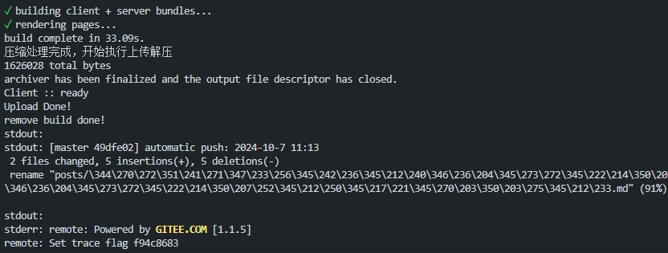

# 为项目的构建增加自动发布能力



## 前提

在使用VitePress构建团队资料库时，突然有了博客也用VitePress搭建的想法，然后在编写过程中想省去发布时一些麻烦的步骤，于是就科普了相关的知识，便在打包的流程加入了发布和推送的脚本

1. ssh2可以与服务器进行连接
2. archiver 可以将产物进行打包
3. 增加npm script，将产物打包和构建发布指令合并

```json
{
    "dev": "vitepress dev --open",
    "build": "vitepress build",
    "preview": "vitepress preview",
    "complete": "run-s build upload push",
    "upload": "node script/deploy.js",
    "push": "node script/push.js",
    "new": "node script/new.js"
 }
```

## 代码

### 发布

```javascript
// 推送到服务器并解压
import { Client } from 'ssh2';
import archiver from 'archiver'

import path from 'node:path'
import fs from 'node:fs'

import picocolors from 'picocolors'

// 执行产物的压缩

const localPath = path.join(path.resolve(),'./build.tar.gz') // 打包产物路径
const localBuildPath = path.join(path.resolve(),'./.vitepress/dist/') // 打包产物路径
const remotePath = '/www/wwwroot/gu1st.cn/build.tar.gz'; // Nginx服务器上的目标路径
const remoteFold = '/www/wwwroot/gu1st.cn' // NGinx 服务器解压目录

const output = fs.createWriteStream(localPath);
const archive = archiver('tar', {
    gzip: true,
    zlib: { level: 9 } // 设置gzip的压缩级别
});

// 归档完成上传
archive.on('close', function (err) {
    console.log(picocolors.blue('压缩处理完成，开始执行上传解压'))
    console.log(archive.pointer() + ' total bytes');

    //  开始执行上传
    const conn = new Client();
    conn.on('ready', () => {
        console.log(picocolors.green('Conn Client ready ::'));
        conn.exec(`rm -rf ${remoteFold}`,(err)=>{
            if(err) throw err;
            console.log(picocolors.green('Clear remoteFold done'))
            conn.sftp((err, sftp) => {
                if (err) throw err;
    
                // 覆盖压缩包上传
                sftp.fastPut(localPath, remotePath, {}, (err) => {
                    if (err) throw err;

                    conn.exec(`chmod 755 ${remotePath}`, (err) => {
                        if (err) throw err;
                        conn.exec(`tar -xzf ${remotePath} -C ${remoteFold}`, (err) => {
                            if (err) throw err;
                            console.log(picocolors.green('Tar overwrite Done!'))
                            conn.end();
                        })
                    })
                });
            });
        })
        
    }).connect({
        host: 'xxx',
        port: xx,
        username: 'xxx',
        privateKey: fs.readFileSync('./xx') // 使用私钥进行认证
    });
});
// 抛出异常
archive.on('error', function (err) {
    throw err;
});
// 管道归档数据到文件
archive.directory(localBuildPath, false); // 第二个参数是是否包含子目录的布尔值，false表示不包含
archive.pipe(output);
archive.finalize();
```

### 构建模板

通过简单的命令快速创建新文章模板

```javascript
// 创建一个新文章  读取指定md文件 copy一份移动到posts下
const fs = require('fs').promises;
const path = require('path');

const sourceFile = path.resolve(__dirname,'../template/new.md');
const targetFile = path.resolve(__dirname,'../posts/new.md');

fs.copyFile(sourceFile, targetFile)

```
