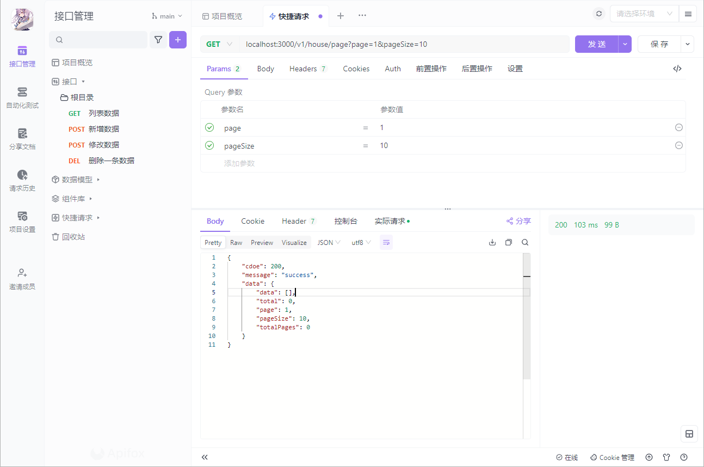

# 结合 NestJs 给 Prisma 扩展 Client 方法

> [!TIP]
> 最近在学习 Prisma 和 Nestjs，发现 Prisma 虽然很方便，类型定义非常牛皮，不过 CRUD 没有提供分页查询，故对其进行扩展

## 增加 Prisma 模块

先编写一个全局 Nestjs 模块，用于注入

```typescript
// prisma.module.ts
import { Global, Module } from "@nestjs/common";
import { PrismaService } from "./prisma.service";

@Global()
@Module({
  providers: [PrismaService],
  exports: [PrismaService],
})
export class PrismaModule {}
```

```typescript
//prisma.service.ts
import { Injectable, OnModuleInit } from "@nestjs/common";
import { PrismaClient } from "prisma/generated/client";

@Injectable()
export class PrismaService extends PrismaClient implements OnModuleInit {
  constructor() {
    super({
      log: [
        {
          emit: "stdout",
          level: "query",
        },
      ],
    });
  }
  // 初始化模块链接
  async onModuleInit() {
    await this.$connect();
  }
}
```

## 扩展模块

接下来在模块注册时，增加自定义的原型方法，并在实现内部通过原型获取到对应的模型

```typescript
interface findPageListOptions {
  where?: any;
  orderBy?: any;
  page: number;
  pageSize: number;
}

@Injectable()
export class PrismaService extends PrismaClient implements OnModuleInit {
  // ...
  async $findPageList(modelName: string, options?: findPageListOptions) {
    const model = this[modelName];

    if (!model) throw new Error(`Model "${modelName}" not found.`);

    const skip = (options.page - 1) * options.pageSize;

    // 获取总数据量
    const total = await model.count();

    // 获取分页数据
    const data = await model.findMany({
      where: options.where,
      orderBy: options.orderBy,
      skip,
      take: options.pageSize,
    });

    return {
      data,
      total,
      page: options.page,
      pageSize: options.pageSize,
      totalPages: Math.ceil(total / options.pageSize),
    };
  }
}
```

### 模块调用

```typescript
async findAllByList(page: number, pageSize: number) {
    return await this.prisma.$findPageList('house', {
      page, pageSize
    });
  }
```


